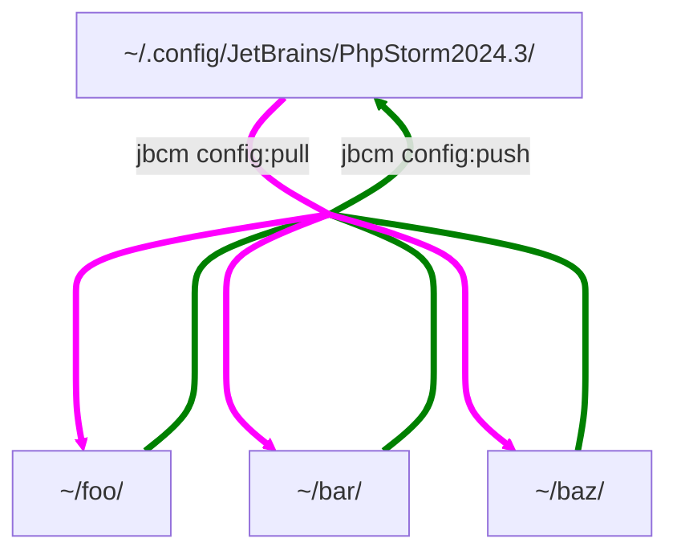

# Config Manager for JetBrains products

[](https://circleci.com/gh/Sweetchuck/WebIdeConfigManager/?branch=2.x)
[](https://app.codecov.io/gh/Sweetchuck/WebIdeConfigManager/branch/2.x)

Helper scripts to synchronize configuration files between:
* teammates
* company and personal laptops


**Supported components**

* [x] `templates` (Live Templates)
* [x] `fileTemplates` (File and Code Templates)
* [x] `colors` (Color Scheme)


## Installation

**Requirements**
* PHP >= 8.4
* PHP extension: dom
* PHP extension: mbstring
* PHP extension: json
* PHP extension: phar

[Tidy PHP extension] is not required, but strongly recommended.
Tidy is used to improve the readability of the VCS tracked `*.xml` files,
in order to have a human friendly `git diff`.

No PHAR release yet.

```bash
cd 'somewhere'
git clone \
    --origin='upstream' \
    --branch='2.x' \
    https://github.com/Sweetchuck/WebIdeConfigManager.git \
    'jbcm-2.x'
cd 'jbcm-2.x'

# Method 1.
composer install --no-dev
php -d 'extension=tidy' ./bin/jbcm

# Method 2.
composer install
./vendor/bin/robo release:build
php -d 'extension=tidy' ./artifacts/jbcm.phar
```


## Example configuration

Create your own repository or use any of the [public config repositories][jbcm wiki - Public Config Repositories].
```bash
if [[ ! -d ~/Documents/JetBrains/PhpStorm/config/sweetchuck/ ]]; then
    mkdir -p ~/Documents/JetBrains/PhpStorm/config/
    git clone \
        --origin='upstream' \
        --branch='1.x' \
        'https://github.com/Sweetchuck/jbcm-sweetchuck.git' \
        ~/Documents/JetBrains/PhpStorm/config/sweetchuck/
fi
```

Add the repository path to the configuration:
```yaml
# File path: ~/.config/jbcm/jbcm.repositories.yml
stash:
    jetBrainsDir: "${env.HOME}/Documents/JetBrains"

products:
    PhpStorm:
        repositories:
            sweetchuck:
                path: "${stash.jetBrainsDir}/PhpStorm/config/sweetchuck"
```

Push the configuration files from all the configured repositories into the active configuration:
```bash
# Exit PhpStorm if it is running.
jbcm config:push PhpStorm
# Start PhpStorm.
```


## Commands

* `jbcm self:config:export`
* `jbcm config:status PhpStorm`
* `jbcm config:diff   PhpStorm`
* `jbcm config:pull   PhpStorm`
* `jbcm config:push   PhpStorm`
* `jbcm config:adopt  PhpStorm templates foo.xml my_repository_01`


## Workflow

* **push** Updates the active configuration of PhpStorm with the one that comes from a local Git repository.
* **pull** Saves the active configuration of PhpStorm into a local Git repository.



[Tidy PHP extension]: https://www.php.net/tidy
[jbcm wiki - Public Config Repositories]: https://github.com/Sweetchuck/WebIdeConfigManager/wiki#public-config-repositories
